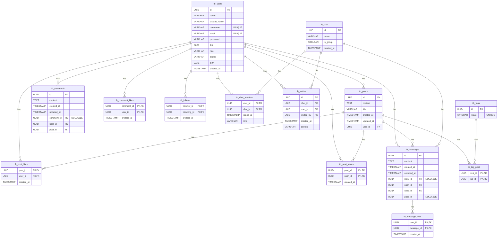

# Banco de Dados

## Tabelas

```mermaid
erDiagram
    direction TB

    tb_users ||--o{ tb_posts : has
    tb_users ||--o{ tb_post_likes : has
    tb_users ||--o{ tb_post_saves : has
    tb_users ||--o{ tb_comments : has
    tb_users ||--o{ tb_comment_likes : has
    tb_users ||--o{ tb_follows : has
    tb_users ||--o{ tb_chat_member : has
    tb_users ||--o{ tb_invites : has
    tb_users ||--o{ tb_messages : has

    tb_posts ||--o{ tb_tag_post : has
    tb_posts ||--o{ tb_messages : has
    tb_posts ||--o{ tb_post_likes : has
    tb_posts ||--o{ tb_post_saves : has

    tb_tags ||--o{ tb_tag_post : has

    tb_chat ||--o{ tb_chat_member : has
    tb_chat ||--o{ tb_invites : has
    tb_chat ||--o{ tb_messages : has

    tb_messages ||--o{ tb_message_likes : has

    tb_users {
        UUID id PK
        VARCHAR name
        VARCHAR display_name
        VARCHAR username "UNIQUE"
        VARCHAR email "UNIQUE"
        VARCHAR password
        TEXT bio
        VARCHAR role
        VARCHAR status
        DATE birth
        TIMESTAMP created_at
    }

    tb_follows {
        UUID follower_id PK,FK
        UUID following_id PK,FK
        TIMESTAMP created_at
    }

    tb_posts {
        UUID id PK
        TEXT content
        VARCHAR title
        TIMESTAMP created_at
        TIMESTAMP updated_at
        UUID user_id FK
    }

    tb_tags {
        UUID id PK
        VARCHAR value "UNIQUE"
    }

    tb_tag_post {
        UUID post_id PK,FK
        UUID tag_id PK,FK
    }

    tb_post_likes {
        UUID post_id PK,FK
        UUID user_id PK,FK
        TIMESTAMP created_at
    }

    tb_post_saves {
        UUID post_id PK,FK
        UUID user_id PK,FK
        TIMESTAMP created_at
    }

    tb_comments {
        UUID id PK
        TEXT content
        TIMESTAMP created_at
        TIMESTAMP updated_at
        UUID comment_id FK "NULLABLE"
        UUID user_id FK
        UUID post_id Fk
    }

    tb_comment_likes {
        UUID comment_id PK,FK
        UUID user_id PK,FK
        TIMESTAMP created_at
    }

    tb_chat {
        UUID id PK
        VARCHAR name
        BOOLEAN is_group
        TIMESTAMP created_at
    }

    tb_invites {
        UUID id PK
        UUID chat_id FK
        UUID user_id FK
        UUID invited_by FK
        TIMESTAMP created_at
        VARCHAR content
    }

    tb_chat_member {
        UUID user_id PK,FK
        UUID chat_id PK,FK
        TIMESTAMP joined_at
        VARCHAR role
    }

    tb_messages {
        UUID id PK
        TEXT content
        TIMESTAMP created_at
        TIMESTAMP updated_at
        UUID reply_id FK "NULLABLE"
        UUID user_id FK
        UUID chat_id FK
        UUID post_id "NULLABLE"
    }

    tb_message_likes {
        UUID user_id PK,FK
        UUID message_id PK,FK
        TIMESTAMP created_at
    }
```
